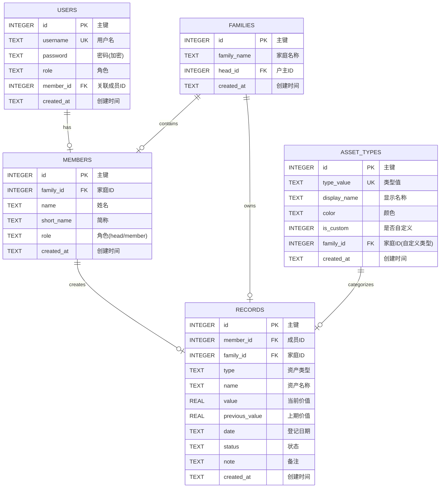

# 数据库设计规范

## 1. 文档信息

- **所属项目**: Ricky Finance - 资产管家
- **文档版本**: v1.0
- **创建日期**: 2026-05-31
- **关联文档**: 
  - [08_技术与附录需求](../requirements/08_技术与附录需求.md)
  - [05_数据流转设计.md](05_数据流转设计.md)（核心数据流依赖本规范定义的表结构）
- **执行优先级**: P0

---

## 2. 数据库选型

| 选型项 | 技术方案 | 选型理由 |
|--------|---------|----------|
| **数据库类型** | SQLite 3.45+ | 轻量级、零配置、适合单机部署场景 |
| **连接模式** | 单例模式 + WAL | 高并发读性能优化，better-sqlite3 内置支持 |
| **字符编码** | UTF-8 | 支持中文数据存储 |
| **事务隔离** | 默认（READ COMMITTED） | 满足业务需求，性能与一致性平衡 |

---

## 3. 表结构设计规范

### 3.1 设计原则

| 原则 | 说明 | 示例 |
|------|------|------|
| **表名** | 小写英文 + 下划线，复数形式 | `asset_records` |
| **字段名** | 小写英文 + 下划线，表意清晰 | `member_id` 而非 `mid` |
| **主键** | 统一使用 `id INTEGER PRIMARY KEY AUTOINCREMENT` | - |
| **外键** | 必须定义，明确级联策略 | `ON DELETE CASCADE` / `SET NULL` |
| **时间字段** | `TEXT` 类型，ISO 8601 格式 | `created_at TEXT DEFAULT (datetime('now'))` |
| **枚举字段** | 使用 `TEXT CHECK` 约束 | `status TEXT CHECK(status IN ('a', 'b', 'c'))` |
| **金额字段** | `REAL` 类型（SQLite 无 DECIMAL） | `value REAL NOT NULL` |

### 3.2 实体关系图（ERD）



### 3.3 索引设计规范

| 表名 | 索引字段 | 索引类型 | 用途 | 优先级 |
|------|---------|---------|------|--------|
| `records` | `member_id, family_id` | 复合索引 | 权限过滤查询 | **P0** |
| `records` | `type, date DESC` | 复合索引 | 类型+日期筛选 | **P0** |
| `records` | `name, date DESC` | 复合索引 | 资产名称去重查询（取最新记录） | **P0** |
| `records` | `family_id, date DESC` | 复合索引 | 家庭资产统计查询 | P1 |
| `members` | `family_id, role` | 复合索引 | 家庭成员权限查询 | P1 |
| `asset_types` | `family_id, type_value` | 复合索引 | 资产类型查询 | P2 |
| `users` | `username` | 唯一索引 | 用户登录查询 | **P0** |

### 3.4 数据约束规范

```sql
-- 资产记录状态约束
ALTER TABLE records ADD CONSTRAINT chk_record_status 
  CHECK(status IN ('valid', 'pending', 'archived'));

-- 资产价值非负约束
ALTER TABLE records ADD CONSTRAINT chk_record_value 
  CHECK(value >= 0);

-- 成员角色约束
ALTER TABLE members ADD CONSTRAINT chk_member_role 
  CHECK(role IN ('head', 'member'));

-- 用户角色约束
ALTER TABLE users ADD CONSTRAINT chk_user_role 
  CHECK(role IN ('admin', 'head', 'member'));

-- 资产类型唯一性约束（家庭维度）
ALTER TABLE asset_types ADD CONSTRAINT unique_asset_type_family 
  UNIQUE(type_value, family_id);

-- 外键级联策略
-- members -> families: ON DELETE CASCADE（家庭删除则成员删除）
-- records -> members: ON DELETE CASCADE（成员删除则记录删除）
-- records -> families: ON DELETE CASCADE（家庭删除则记录删除）
-- users -> members: ON DELETE SET NULL（成员删除，用户关联置空）
-- families -> members(head_id): ON DELETE SET NULL（户主删除，家庭户主置空）
```

---

## 4. 数据迁移规范

### 4.1 迁移文件命名规则

```
server/db/migrations/
├── 001_initial_schema.sql
├── 002_add_constraints.sql
├── 003_add_indexes.sql
├── 004_seed_default_data.sql
└── 005_add_new_field.sql
```

**命名格式**: `{三位序号}_{描述}.sql`

### 4.2 迁移执行流程

```
1. 检查数据库版本（存储在 metadata 表）
2. 扫描 migrations 目录获取所有迁移脚本
3. 按序号顺序执行未执行的脚本
4. 记录已执行的迁移版本
5. 失败时回滚并记录错误日志
6. 更新当前数据库版本
```

### 4.3 迁移脚本模板

```sql
-- 001_initial_schema.sql
BEGIN TRANSACTION;

-- 创建表结构
CREATE TABLE IF NOT EXISTS users (...);
CREATE TABLE IF NOT EXISTS families (...);
-- ... 其他表

COMMIT;
```

---

## 5. 数据访问规范

### 5.1 查询优化原则

| 原则 | 说明 | 反例 | 正例 |
|------|------|------|------|
| 避免 SELECT * | 明确指定字段 | `SELECT * FROM records` | `SELECT id, name, value FROM records` |
| 使用参数化查询 | 防止 SQL 注入 | `db.prepare("SELECT * FROM users WHERE username = '" + input + "'")` | `db.prepare("SELECT * FROM users WHERE username = ?")` |
| 限制返回行数 | 分页查询 | 无 LIMIT | `SELECT * FROM records LIMIT 10 OFFSET 0` |
| 合理使用 JOIN | 减少嵌套查询 | 多层子查询 | `SELECT r.*, m.name FROM records r JOIN members m ON r.member_id = m.id` |

### 5.2 事务使用规范

| 场景 | 是否使用事务 | 说明 |
|------|-------------|------|
| 单条记录插入 | 否 | SQLite 自动处理 |
| 多条关联记录操作 | **是** | 保证数据一致性 |
| 数据迁移 | **是** | 失败可回滚 |
| 批量更新 | **是** | 避免部分更新 |

```javascript
// 事务使用示例
const db = getDb();
const transaction = db.transaction(() => {
  // 执行多个操作
  db.prepare('INSERT INTO members (...) VALUES (...)').run(...);
  db.prepare('UPDATE families SET head_id = ? WHERE id = ?').run(...);
});

try {
  transaction();
} catch (e) {
  console.error('事务执行失败:', e);
  throw e;
}
```

---

## 6. 数据安全规范

| 规范项 | 要求 | 责任人 |
|--------|------|--------|
| **密码存储** | 使用 bcrypt 算法，10+ 轮加密 | 开发 |
| **敏感数据脱敏** | 日志中不记录密码、Token 等 | 开发 |
| **数据库文件权限** | 设置为 600（仅所有者可读写） | 运维 |
| **定期备份** | 每日自动备份，保留 7 天 | 运维 |
| **访问审计** | 记录关键操作日志 | 开发 |
| **数据清理** | 归档历史数据，定期清理 | 运维 |

---

## 7. 数据字典

### 7.1 表字段说明

#### 7.1.1 users 表

| 字段名 | 类型 | 约束 | 说明 |
|--------|------|------|------|
| `id` | INTEGER | PK, AUTOINCREMENT | 用户唯一标识 |
| `username` | TEXT | NOT NULL, UNIQUE | 登录用户名 |
| `password` | TEXT | NOT NULL | 加密后的密码 |
| `role` | TEXT | NOT NULL, DEFAULT 'member' | 角色：admin/head/member |
| `member_id` | INTEGER | NULLABLE, FK | 关联的家庭成员 ID |
| `created_at` | TEXT | NOT NULL, DEFAULT datetime('now') | 创建时间 |

#### 7.1.2 families 表

| 字段名 | 类型 | 约束 | 说明 |
|--------|------|------|------|
| `id` | INTEGER | PK, AUTOINCREMENT | 家庭唯一标识 |
| `family_name` | TEXT | NOT NULL | 家庭名称 |
| `head_id` | INTEGER | NULLABLE, FK | 户主成员 ID |
| `created_at` | TEXT | NOT NULL | 创建时间 |

#### 7.1.3 members 表

| 字段名 | 类型 | 约束 | 说明 |
|--------|------|------|------|
| `id` | INTEGER | PK, AUTOINCREMENT | 成员唯一标识 |
| `family_id` | INTEGER | NOT NULL, FK | 所属家庭 ID |
| `name` | TEXT | NOT NULL | 成员姓名 |
| `short_name` | TEXT | NULLABLE | 姓名简称（用于显示） |
| `role` | TEXT | NOT NULL, DEFAULT 'member' | 角色：head/member |
| `created_at` | TEXT | NOT NULL | 创建时间 |

#### 7.1.4 asset_types 表

| 字段名 | 类型 | 约束 | 说明 |
|--------|------|------|------|
| `id` | INTEGER | PK, AUTOINCREMENT | 类型唯一标识 |
| `type_value` | TEXT | NOT NULL | 类型值（用于存储） |
| `display_name` | TEXT | NOT NULL | 显示名称（用于展示） |
| `color` | TEXT | NOT NULL | 显示颜色（十六进制） |
| `is_custom` | INTEGER | DEFAULT 0 | 是否自定义类型 |
| `family_id` | INTEGER | NULLABLE, FK | 所属家庭（自定义类型） |
| `created_at` | TEXT | NOT NULL | 创建时间 |

#### 7.1.5 records 表

| 字段名 | 类型 | 约束 | 说明 |
|--------|------|------|------|
| `id` | INTEGER | PK, AUTOINCREMENT | 记录唯一标识 |
| `member_id` | INTEGER | NOT NULL, FK | 创建记录的成员 ID |
| `family_id` | INTEGER | NOT NULL, FK | 所属家庭 ID（冗余字段，优化查询） |
| `type` | TEXT | NOT NULL | 资产类型（关联 asset_types.type_value） |
| `name` | TEXT | NOT NULL | 资产名称 |
| `value` | REAL | NOT NULL, >= 0 | 当前价值 |
| `previous_value` | REAL | NULLABLE | 上期价值（用于计算变化） |
| `date` | TEXT | NOT NULL | 登记日期（业务日期） |
| `status` | TEXT | NOT NULL, DEFAULT 'valid' | 状态：valid/pending/archived |
| `note` | TEXT | NULLABLE | 备注说明 |
| `created_at` | TEXT | NOT NULL | 记录创建时间 |

---

## 8. 与数据流转设计的关联

### 8.1 文档协作关系

| 文档 | 职责 | 关系 |
|------|------|------|
| **本规范**（02_数据库设计规范） | 定义**数据存储结构**：表、字段、索引、约束 | 上游：提供数据基础设施 |
| **05_数据流转设计** | 定义**数据流动路径**：API、权限、读写流程 | 下游：使用本规范的表结构进行数据操作 |

### 8.2 核心数据流与数据表映射

| 数据流场景 | 涉及的表 | 操作类型 | 数据流转文档位置 |
|-----------|---------|---------|-----------------|
| 新增资产记录 | `records`、`members` | INSERT、SELECT | §2.2 写入链路详解 |
| 资产列表查询 | `records`、`asset_types`、`members` | SELECT（JOIN） | §2.1 数据流转全景 |
| 资产名称筛选 | `records` | SELECT DISTINCT | §4.2 数据流转链路 |
| 仪表盘统计 | `records`、`members` | SELECT（聚合） | §3.1 读取流程 |
| 跨角色可见性 | `records`、`members`、`families` | SELECT（权限过滤） | §5.2 成员录入→户主可见链路 |

### 8.3 关键字段在数据流中的作用

| 字段 | 表 | 在数据流中的作用 |
|------|------|----------------|
| `family_id` | `records`、`members` | **核心共享键**：户主能看到家庭成员记录的关键 |
| `member_id` | `records` | **个人隔离键**：成员只能看到自己记录的关键 |
| `status` | `records` | **状态过滤**：统计时排除 pending/archived 记录 |
| `date` | `records` | **时间维度**：月度统计、最新记录筛选 |
| `name` | `records` | **资产标识**：按名称去重取最新价值 |

### 8.4 一致性保障机制

```
数据流转层（05文档）                        数据库层（本规范）
─────────────────────────────────────────────────────────────────
│                                                  │
│  1. API 输入校验                                 │  1. CHECK 约束（value >= 0, status 枚举）
│     → 拒绝非法值                                  │     → 数据库层面二次保障
│                                                  │
│  2. 权限过滤                                     │  2. 外键约束（member_id REFERENCES members）
│     → WHERE member_id = ?                       │     → 防止写入不存在的成员
│                                                  │
│  3. 事务操作                                     │  3. 事务支持（BEGIN/COMMIT）
│     → 多条记录原子性写入                          │     → 保证数据完整性
│                                                  │
│  4. 索引优化查询                                 │  4. 复合索引（member_id+family_id 等）
│     → 提升查询性能                               │     → 支撑高效权限过滤
│                                                  │
```

---

## 9. 后续演进建议

| 阶段 | 目标 | 行动 |
|------|------|------|
| **阶段1** | 基础规范落地 | 创建文档、添加约束和索引 |
| **阶段2** | 数据迁移能力 | 实现迁移脚本执行器 |
| **阶段3** | 数据质量管理 | 建立数据校验和清洗机制 |
| **阶段4** | 性能优化 | 根据数据量调整索引和查询策略 |
| **阶段5** | 扩展性支持 | 评估是否需要迁移到 PostgreSQL |

---

**文档版本**: v1.0  
**最后更新**: 2026-05-31
