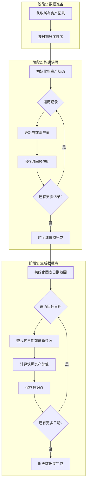
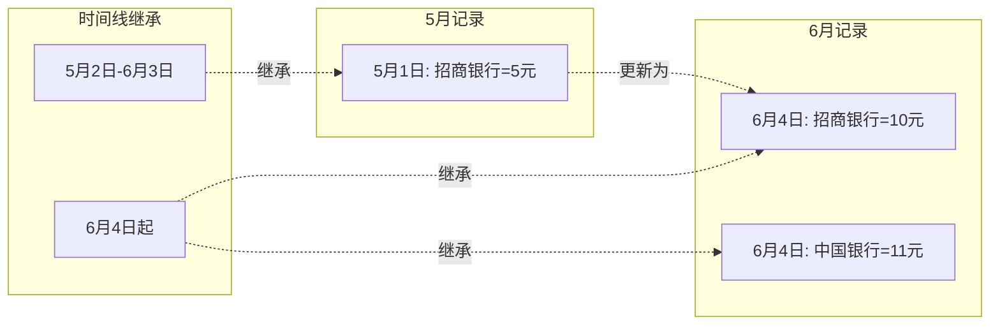

# 数据流转设计文档

## 1. 文档信息

- **所属项目**: Ricky Finance - 资产管家
- **文档版本**: v1.0
- **创建日期**: 2026-05-31
- **文档性质**: 技术设计 — 数据流转
- **相关需求**: [03_资产记录管理](../requirements/03_资产记录与类型管理.md)、[04_资产概览与分析](../requirements/04_资产概览与数据分析.md)
- **相关技术规范**: 
  - [API 接口规范](03_API接口规范.md)
  - [认证与安全设计](04_认证与安全设计.md)
  - [数据库设计规范](02_数据库设计规范.md)（本文档所有数据流基于该规范定义的表结构）

---

## 目录

- [2. 资产记录 CRUD 闭环](#2-资产记录-crud-闭环)
  - [2.1 数据流转全景](#21-数据流转全景)
  - [2.2 写入链路详解](#22-写入链路详解)
  - [2.3 前端 UI 更新闭环](#23-前端-ui-更新闭环)
  - [2.4 关键设计决策](#24-关键设计决策)
- [3. 仪表盘数据聚合链路](#3-仪表盘数据聚合链路)
  - [3.1 读取流程](#31-读取流程)
  - [3.2 Stats API 字段映射](#32-stats-api-字段映射)
  - [3.3 权限控制下的数据范围](#33-权限控制下的数据范围)
- [3.4 同一资产名称去重统计链路](#34-同一资产名称去重统计链路)
- [4. 跨角色数据可见性](#4-跨角色数据可见性)
  - [4.1 可见性规则](#41-可见性规则)
  - [4.2 成员录入 → 户主可见 链路](#42-成员录入--户主可见-链路)
  - [4.3 反向隔离验证](#43-反向隔离验证)
- [5. 跨模块数据关联总览](#5-跨模块数据关联总览)
  - [5.1 需求与实现映射](#51-需求与实现映射)
  - [5.2 数据变更影响范围](#52-数据变更影响范围)

---

## 2. 资产记录 CRUD 闭环

> 对应需求：[03_资产记录管理 §2.2 资产记录功能](../requirements/03_资产记录与类型管理.md#22-资产记录功能)

### 2.1 数据流转全景

```
┌─────────────────────────────────────────────────────────────────────┐
│                    需求 03 — 资产记录管理（records.html）              │
│                                                                      │
│  用户操作                       前端 API 调用                         │
│  ┌──────────────┐    ┌──────────────────────────────┐               │
│  │ 新增资产记录  │───▶│ API.createRecord(data)        │               │
│  │ 编辑资产记录  │───▶│ API.updateRecord(id, data)    │               │
│  │ 删除资产记录  │───▶│ API.deleteRecord(id)          │               │
│  │ 添加资产类型  │───▶│ API.createAssetType(data)     │               │
│  └──────────────┘    └──────────┬───────────────────┘               │
│                                 │                                     │
│                                 │ HTTP POST/PUT/DELETE               │
│                                 ▼                                     │
├─────────────────────────────────────────────────────────────────────┤
│                       后端 API 层                                     │
│                                                                      │
│  POST /api/records        →  records.js  → INSERT INTO records      │
│  PUT  /api/records/:id    →  records.js  → UPDATE records           │
│  DELETE /api/records/:id  →  records.js  → DELETE FROM records      │
│                                 │                                     │
│                                 │ 写入                                │
│                                 ▼                                     │
│                  SQLite 数据库 — records 表                           │
│                                 │                                     │
│                                 │ 读取 + 聚合                         │
│                                 ▼                                     │
│  GET /api/stats  →  stats.js                                         │
│    按资产名称去重取最新记录：                                            │
│    SELECT name, MAX(date), value FROM records GROUP BY name           │
│    SUM(最新记录.value)                     → totalValue               │
│    COUNT(*)                               → totalRecords             │
│    GROUP BY type（基于最新记录）           → typeDistribution         │
│                                 │                                     │
│                                 │ HTTP 200 JSON                      │
│                                 ▼                                     │
├─────────────────────────────────────────────────────────────────────┤
│                    需求 04 — 资产概览与分析（dashboard.html）          │
│                                                                      │
│  api.getStats()     → 统计卡片（总资产、记录数、成员数、本月新增）    │
│  api.getRecords()   → 最近记录列表（8 条）                            │
│  api.getMembers()   → 家庭成员卡片                                    │
└─────────────────────────────────────────────────────────────────────┘
```

### 2.2 写入链路详解

#### 步骤 1：前端表单提交

用户在弹窗中填写表单并点击"确认保存"，前端 [api.js](file:///d:/TRAEworkspace/Ricky_finance_repository/Ricky_finance/public/js/api.js) 发起 HTTP 请求：

```javascript
// public/js/api.js
async function createRecord(data) {
  return request('/api/records', {
    method: 'POST',
    body: JSON.stringify(data)
  });
}
```

**请求体示例**（新增）：
```json
{
  "type": "stock", "name": "招商银行股票", "value": 1250000,
  "date": "2026-05-27",
  "note": "客户追加投资", "memberId": 1
}
```

**请求体示例**（编辑，部分更新）：
```json
{ "value": 1300000, "date": "2026-05-28" }
```

#### 步骤 2：后端路由接收

| 操作 | HTTP 方法 | 路由 | Handler |
|------|-----------|------|---------|
| 新增 | POST | `/api/records` | `router.post('/', authMiddleware, ...)` |
| 编辑 | PUT | `/api/records/:id` | `router.put('/:id', authMiddleware, ...)` |
| 删除 | DELETE | `/api/records/:id` | `router.delete('/:id', authMiddleware, ...)` |

#### 步骤 3：权限校验 + 参数验证

```javascript
// server/routes/records.js — POST handler
router.post('/', authMiddleware, (req, res) => {
  // 1. admin 禁止添加 → 403
  // 2. head 为其他成员添加 → 校验该成员是否属于本家庭 → 403
  // 3. 必填项校验 → type/name/value/date 缺少 → 400
  // 4. 成员存在性校验 → 成员不存在 → 400
  // 5. 通过后执行 INSERT
});
```

#### 步骤 4：写入数据库

```javascript
// INSERT 操作
db.prepare(`
  INSERT INTO records (member_id, family_id, type, name, value, date, status, note)
  VALUES (?, ?, ?, ?, ?, ?, 'valid', ?)
`).run(targetMemberId, member.family_id, type, name, Number(value), date, note);

// UPDATE 操作（COALESCE 部分更新策略）
db.prepare(`
  UPDATE records
  SET type = COALESCE(?, type), name = COALESCE(?, name),
      value = CASE WHEN ? IS NOT NULL THEN ? ELSE value END, ...
  WHERE id = ?
`).run(type, name, value, value, ..., req.params.id);
```

#### 步骤 5：后端返回响应

**新增成功**（HTTP 201）：
```json
{
  "success": true,
  "data": {
    "id": 6, "member_id": 1, "family_id": 1,
    "type": "stock", "name": "招商银行股票", "value": 1250000,
    "date": "2026-05-27",
    "status": "valid", "note": "客户追加投资",
    "member_name": "张三", "type_display": "股票", "type_color": "#f59e0b"
  }
}
```

**编辑成功**（HTTP 200）：
```json
{
  "success": true,
  "data": { "id": 1, "value": 1300000, "previous_value": 1250000, ... }
}
```

**删除成功**（HTTP 200）：
```json
{ "success": true, "message": "记录已删除" }
```

---

### 2.3 前端 UI 更新闭环

后端返回响应后，[records.html](file:///d:/TRAEworkspace/Ricky_finance_repository/Ricky_finance/public/records.html) 中的 `handleSubmit` / `doDelete` 执行以下闭环：

```
用户点击"保存"/"删除"
    │
    ▼
① 组装数据 + 调用 API
   editingId
   ? API.updateRecord(id, data)   ← 编辑
   : API.createRecord(data)       ← 新增
   API.deleteRecord(id)           ← 删除
    │
    ▼
② 后端: server/routes/records.js
   权限校验 → INSERT/UPDATE/DELETE → 返回 JSON
    │
    ▼
③ 前端接收响应
   if (res.success) {
     Utils.toast('操作成功')       ← 用户反馈
     closeModal()                 ← 关闭弹窗
     await Promise.all([
       loadRecords(),              ← 重新拉取 → 表格刷新
       loadStats()                 ← 重新拉取 → 统计卡片更新
     ]);
   }
    │
    ▼
④ 页面结果（用户可见）
   · Toast 提示"添加成功" / "更新成功" / "删除成功"
   · 弹窗关闭
   · 表格中出现新增/修改后的数据行
   · 顶部统计卡片数字更新
```

**关键代码**（records.html `handleSubmit`）：
```javascript
async function handleSubmit(e) {
    e.preventDefault();
    const data = { member_id, type, name, value, date, note };
    let res = editingId
      ? await API.updateRecord(editingId, data)
      : await API.createRecord(data);
    if (res.success) {
        Utils.toast(editingId ? '更新成功' : '添加成功');
        closeModal();
        await Promise.all([loadRecords(), loadStats()]);
    } else {
        Utils.toast(res.message || '操作失败', 'error');
    }
}
```

**数据闭环总结**：
```
用户操作 → handleSubmit() → API.xxxRecord() → HTTP → 后端 DB 写入
→ 返回 JSON → res.success ? Toast + closeModal + Promise.all([loadRecords, loadStats])
→ 页面刷新（表格 + 统计卡片）
```

### 2.4 关键设计决策

| 决策 | 说明 |
|------|------|
| **全量刷新策略** | 操作成功后重新拉取全量数据而非局部 DOM 更新，确保统计卡片联动一致 |
| **并行加载** | `loadRecords()` 和 `loadStats()` 通过 `Promise.all` 并行执行 |
| **错误不关闭弹窗** | 后端返回 `success: false` 时仅显示错误 Toast，弹窗保持打开 |
| **删除同路径** | 删除操作也走 `loadRecords() + loadStats()` 刷新路径 |

---

## 3.4 同一资产名称去重统计链路

> 对应需求：[03_资产记录 §2.5 同一资产名称的记录更新规则](../requirements/03_资产记录与类型管理.md#25-同一资产名称的记录更新规则)

### 3.4.1 业务场景

```
用户记录历史：
┌────┬──────────┬────────┬────────────┐
│ id │ name     │ value  │ date       │
├────┼──────────┼────────┼────────────┤
│ 1  │ 招商银行  │ 10元   │ 2026-01-15 │
│ 2  │ 招商银行  │ 30元   │ 2026-02-20 │ ← 最新记录（工资进账后更新）
│ 3  │ 贵州茅台  │ 50元   │ 2026-02-18 │
└────┴──────────┴────────┴────────────┘

统计计算结果：
✅ 正确：总资产 = 30元（招商银行最新）+ 50元（贵州茅台最新）= 80元
❌ 错误：总资产 = 10元 + 30元 + 50元 = 90元（累加所有记录）
```

### 3.4.2 数据流转

```
资产记录表（records）
    │
    ▼ 按 name + member_id 分组，取每组 date 最大的记录
┌─────────────────────────────────────────┐
│ 子查询：获取每个资产名称的最新记录         │
│ SELECT name, member_id, MAX(date)        │
│ FROM records                             │
│ WHERE status = 'valid'                   │
│ GROUP BY name, member_id                 │
└─────────────────────────────────────────┘
    │
    ▼ JOIN 回原表获取完整记录信息
┌─────────────────────────────────────────┐
│ 最新记录集（latest_records）              │
│ 仅包含每个资产名称的最新一期记录           │
└─────────────────────────────────────────┘
    │
    ├──▶ SUM(value) ──▶ totalValue（总资产）
    │
    ├──▶ GROUP BY type ──▶ typeDistribution（类型分布）
    │
    └──▶ 按 member_id 分组 ──▶ 成员资产汇总
```

### 3.4.3 关键设计决策

| 决策 | 说明 |
|------|------|
| **分组维度** | `name + member_id` 联合分组，确保不同成员的同名称资产独立计算 |
| **排序依据** | 按 `date` 倒序取最新，而非 `created_at`，因为用户可能补录历史记录 |
| **状态过滤** | 仅统计 `status = 'valid'` 的记录，排除待审核和无效记录 |
| **历史保留** | 所有记录保留在数据库中，仅统计时去重，支持变更时间线查看 |

---

## 3.5 资产趋势图历史继承链路（v2.5 新增）

> 对应需求：[04_资产概览 §3.1.1 资产趋势图数据计算规则](../requirements/04_资产概览与数据分析.md#311-资产趋势图数据计算规则)

### 3.5.1 业务场景

```
用户记录历史：
┌────┬──────────┬────────┬────────────┐
│ id │ name     │ value  │ date       │
├────┼──────────┼────────┼────────────┤
│ 1  │ 招商银行  │ 5元    │ 2026-05-01 │
│ 2  │ 招商银行  │ 10元   │ 2026-06-04 │ ← 更新同一资产
│ 3  │ 中国银行  │ 11元   │ 2026-06-04 │ ← 新增资产
└────┴──────────┴────────┴────────────┘

趋势图数据点计算：
┌────────────┬─────────────────────────────┬──────────┐
│ 日期       │ 资产快照                    │ 总资产   │
├────────────┼─────────────────────────────┼──────────┤
│ 2026-05-01 │ {招商银行: 5}               │ 5元      │ ← 首次登记
│ 2026-05-02 │ {招商银行: 5}               │ 5元      │ ← 继承前一日
│ ...        │ ...                         │ ...      │ ← 持续继承
│ 2026-06-03 │ {招商银行: 5}               │ 5元      │ ← 持续继承
│ 2026-06-04 │ {招商银行: 10, 中国银行: 11}│ 21元     │ ← 更新后
└────────────┴─────────────────────────────┴──────────┘
```

### 3.5.2 数据流转

```
资产记录表（records）
    │
    ▼ 按日期升序排序
┌─────────────────────────────────────────┐
│ 排序后的记录列表                          │
│ ORDER BY date ASC                        │
└─────────────────────────────────────────┘
    │
    ▼ 遍历记录，构建时间线快照
┌─────────────────────────────────────────┐
│ 时间线快照（timeline）                    │
│ 每个元素: { date, assetValues: {} }       │
│                                          │
│ 处理逻辑:                                 │
│ 1. currentAssets[资产名] = 最新值         │
│ 2. timeline.push({                       │
│      date: 当前日期,                      │
│      assetValues: {...currentAssets}     │
│    })                                    │
└─────────────────────────────────────────┘
    │
    ▼ 生成趋势图数据点
┌─────────────────────────────────────────┐
│ 对于每个目标日期:                          │
│ 1. 在 timeline 中查找 ≤ 目标日期的最新快照  │
│ 2. 将快照中所有资产值求和                   │
│ 3. 作为该日期的总资产显示                   │
└─────────────────────────────────────────┘
    │
    ├──▶ Chart.js 折线图数据集
```

### 3.5.3 关键设计决策

| 决策 | 说明 |
|------|------|
| **排序方向** | 按 `date ASC` 升序处理，便于构建正确的时间线 |
| **快照机制** | 每个有记录的日期保存一份完整的资产快照（深拷贝） |
| **继承规则** | 无记录日期使用最近的资产快照，不显示为0 |
| **资产更新** | 同一资产名称后登记的覆盖先登记的 |
| **查询效率** | 时间线数组已按日期排序，查找使用线性扫描即可 |

### 3.5.4 处理流程图示

**时间线快照构建流程**：



**资产继承关系图**：



---

## 3. 仪表盘数据聚合链路

> 对应需求：[04_资产概览与分析](../requirements/04_资产概览与数据分析.md)

### 3.1 读取流程

```
dashboard.html 页面加载
│
├── API.getStats()           → GET /api/stats
│   │
│   └── server/routes/stats.js
│       ├── 总资产计算（按名称去重取最新）       → totalValue
│       │   SELECT SUM(value) FROM (
│       │     SELECT value FROM records 
│       │     WHERE status='valid'
│       │     GROUP BY name ORDER BY date DESC LIMIT 1
│       │   ) AS latest_records
│       ├── COUNT(*)                           → totalRecords
│       ├── COUNT(DISTINCT member_id)          → activeMembers
│       ├── COUNT(*) WHERE date >= '当月1日'    → monthlyNew
│       ├── COUNT(*) WHERE status='pending'    → pendingCount
│       └── 类型分布（按类型分组，每组内按名称去重取最新后汇总）→ typeDistribution
│
├── API.getRecords({})       → GET /api/records
│   └── 渲染"最近记录"列表（取前 8 条）
│
└── API.getMembers()         → GET /api/members
    └── 渲染"家庭成员卡片"区（含 record_count、total_value）
```

**总资产计算逻辑说明**：
1. **核心原则**：同一资产名称可能有多条历史记录（如"招商银行股票"在不同日期的记录），总资产应仅统计每个资产名称的最新一期价值
2. **计算方式**：先按资产名称（`name`）分组，每组内按记录日期（`date`）倒序排列，取第一条作为最新记录；然后将所有最新记录的价值（`value`）求和
3. **业务理由**：用户可能不定期更新资产价值（有变动才更新），最新记录代表该资产当前的真实价值，历史记录用于追溯和趋势分析

### 3.2 Stats API 字段映射

| Stats API 字段 | 仪表盘显示 | 计算方式 |
|----------------|-----------|----------|
| `totalValue` | 总资产卡片 | **按资产名称去重，仅汇总每个名称的最新记录**：`SUM(latest.value)` 其中 latest 是每个 name 组中 date 最大的记录 |
| `totalRecords` | 记录总数 | `COUNT(*)` |
| `memberCount` / `activeMembers` | 成员数 | `COUNT(*)` / 有 valid 记录的成员 |
| `monthlyNew` | 本月新增 | `COUNT(*) WHERE date >= 当月1日` |
| `typeDistribution` | 资产分布列表 | **按资产类型分组，每组内按名称去重取最新记录后汇总** |

### 3.3 权限控制下的数据范围

同一套 `GET /api/stats`，不同角色看到不同范围：

| 角色 | 数据范围 | WHERE 条件 |
|------|---------|------------|
| admin | 全系统 | 无额外条件 |
| head | 本家庭 | `WHERE r.family_id = ?` |
| member | 个人 | `WHERE r.member_id = ?` |

---

## 4. 资产名称筛选数据流

> 对应需求：[03_资产记录管理 §2.3 记录筛选与搜索](../requirements/03_资产记录与类型管理.md#23-记录筛选与搜索)

### 4.1 业务场景

用户在资产记录列表页的筛选栏中，通过下拉选择框筛选特定资产名称的记录。下拉选项来自用户已登记的资产记录，由后端 API 动态返回。

### 4.2 数据流转链路

```
records.html 页面加载
│
└── 筛选栏初始化
    │
    ├── API.getAssetNames()  → GET /api/records/asset-names
    │   │
    │   └── server/routes/records.js
    │       ├── 权限校验（admin/head/member）
    │       └── SELECT DISTINCT name FROM records
    │           WHERE <权限过滤条件>
    │           ORDER BY createdAt DESC
    │
    └── 渲染资产名称下拉选择框
        │
        │ 用户选择某个资产名称
        │
        └── API.getRecords({ name: selectedName })  → GET /api/records?name=xxx
            │
            └── server/routes/records.js
                └── SELECT * FROM records
                    WHERE name = 'xxx' AND <权限过滤条件>
```

### 4.3 前端调用流程

```javascript
// public/js/api.js
async function getAssetNames(keyword = '') {
  return request(`/api/records/asset-names?keyword=${encodeURIComponent(keyword)}`);
}

// records.html — 页面加载时调用
async function initAssetNameFilter() {
  const names = await API.getAssetNames();
  const select = document.getElementById('asset-name-filter');
  names.forEach(name => {
    const option = document.createElement('option');
    option.value = name;
    option.textContent = name;
    select.appendChild(option);
  });
}

// records.html — 用户选择后触发
document.getElementById('asset-name-filter').addEventListener('change', async (e) => {
  const selectedName = e.target.value;
  currentFilters.assetName = selectedName || null;
  await loadRecords();
});
```

### 4.4 后端 API 实现

**API 端点**：`GET /api/records/asset-names`

**请求参数**：

| 参数 | 类型 | 必填 | 说明 |
|------|------|------|------|
| keyword | string | 否 | 模糊搜索关键词 |

**权限控制**：

| 角色 | 数据范围 | WHERE 条件 |
|------|---------|------------|
| admin | 全系统 | 无额外条件 |
| head | 本家庭 | `WHERE r.family_id = ?` |
| member | 个人 | `WHERE r.member_id = ?` |

**后端代码示意**：

```javascript
// server/routes/records.js
router.get('/asset-names', authMiddleware, (req, res) => {
  const { keyword } = req.query;
  const user = req.user;
  
  let sql = 'SELECT DISTINCT name FROM records';
  let params = [];
  
  // 权限过滤
  if (user.role === 'member') {
    sql += ' WHERE member_id = ?';
    params.push(user.member_id);
  } else if (user.role === 'head') {
    sql += ' WHERE family_id = ?';
    params.push(user.family_id);
  }
  
  // 模糊搜索
  if (keyword) {
    sql += (params.length ? ' AND' : ' WHERE') + ' name LIKE ?';
    params.push(`%${keyword}%`);
  }
  
  sql += ' ORDER BY createdAt DESC';
  
  const names = db.prepare(sql).all(...params).map(row => row.name);
  res.json({ success: true, data: names });
});
```

**返回示例**：

```json
{
  "success": true,
  "data": ["招商银行股票", "华夏成长基金", "腾讯控股", "易方达蓝筹基金"]
}
```

### 4.5 数据流转闭环

```
用户打开 records.html
    │
    ▼
① initAssetNameFilter() 调用
    │
    ▼
② API.getAssetNames() → GET /api/records/asset-names
    │
    ▼
③ 后端权限校验 + 去重查询
    │
    ▼
④ 返回资产名称数组
    │
    ▼
⑤ 前端渲染下拉选择框
    │
    │ 用户选择"招商银行股票"
    │
    ▼
⑥ 触发 change 事件 → 更新 currentFilters.assetName
    │
    ▼
⑦ loadRecords() 调用 → GET /api/records?name=招商银行股票
    │
    ▼
⑧ 后端过滤查询 → 返回匹配的记录
    │
    ▼
⑨ 前端刷新表格 → 只显示"招商银行股票"的记录
```

---

## 5. 跨角色数据可见性

> 对应需求：[03_资产记录管理 §2.2.1 多角色数据可见性规则](../requirements/03_资产记录与类型管理.md#221-多角色数据可见性规则)

### 5.1 可见性规则

```
角色          可见范围               说明
─────────────────────────────────────────────
admin         所有家庭的记录         全局管理（增删改查所有记录）
head（户主）  本家庭全部成员的记录   可管理本家庭任意成员记录
member（成员）仅自己的记录           只能操作自己的记录
```

### 5.1.1 新增记录时的成员选择规则

| 角色 | 是否允许新增 | 是否必须选择成员 | 说明 |
|------|-------------|-----------------|------|
| admin | ✅ | ✅ 是 | 管理员必须在表单中选择目标成员 |
| head | ✅ | ❌ 否 | 户主可选择成员，未选择时默认添加给自己 |
| member | ✅ | ❌ 不可选 | 成员只能为自己添加记录 |

### 5.2 成员录入 → 户主可见 链路

核心机制：**`family_id` 字段作为共享键**。

```
成员"李四"（member）                         户主"张三"（head）
│                                            │
POST /api/records                   GET /api/records（无 memberId 参数）
Body: { type: "fund",              req.user.familyId = 1
  name: "华夏成长基金", ... }
│                                            │
▼                                            ▼
server/routes/records.js — POST     server/routes/records.js — GET
│                                            │
① 权限校验（member → targetMemberId）       ① 权限过滤（head → family_id）
② SELECT family_id FROM members            ② SELECT * FROM records
   WHERE id = targetMemberId                   WHERE r.family_id = 1
   → member.family_id = 1                      → 返回李四的记录（family_id 相同）
③ INSERT INTO records                      ③ 户主页面显示李四的记录
   (member_id=2, family_id=1, ...)
│
▼
records 表新行：
┌────┬───────────┬───────────┬──────┬──────────┐
│ id │ member_id │ family_id │ type │ name     │
├────┼───────────┼───────────┼──────┼──────────┤
│ 99 │  2 (李四)  │  1 (张家)  │ fund │ 华夏成长 │
└────┴───────────┴───────────┴──────┴──────────┘
```

**核心实现机制**：

| 机制 | 代码位置 | 说明 |
|------|----------|------|
| 写入时关联 family_id | [records.js POST handler](file:///d:/TRAEworkspace/Ricky_finance_repository/Ricky_finance/server/routes/records.js#L120-L130) | 从 members 表获取 family_id 写入 |
| 查询时按 family_id 过滤 | [records.js GET handler](file:///d:/TRAEworkspace/Ricky_finance_repository/Ricky_finance/server/routes/records.js#L18-L21) | head 角色自动 WHERE family_id |
| 前端默认不过滤成员 | [records.html L681](file:///d:/TRAEworkspace/Ricky_finance_repository/Ricky_finance/public/records.html#L681) | memberFilter 为空时不传 memberId |

### 4.3 反向隔离验证

成员查询时走 `WHERE r.member_id = req.user.memberId`（[records.js:L22-L24](file:///d:/TRAEworkspace/Ricky_finance_repository/Ricky_finance/server/routes/records.js#L22-L24)），确保只能看到自己的记录。

---

## 5. 跨模块数据关联总览

### 5.1 需求与实现映射

```
┌───────────────────────────────────────────────────────────────────────┐
│                        需求文档层（WHAT）                              │
│                                                                       │
│  ┌─────────────────────┐  ┌─────────────────────┐                    │
│  │ 03_资产记录与类型管理 │  │ 04_资产概览与数据分析 │                    │
│  │ • 新增/编辑/删除记录  │  │ • 统计卡片            │                    │
│  │ • 筛选与搜索         │  │ • 资产分布            │                    │
│  │ • 变更时间线         │  │ • 最近记录            │                    │
│  │ • 资产类型管理       │  │ • 成员卡片            │                    │
│  └─────────┬───────────┘  └──────────┬──────────┘                    │
│            │ "录入"                  │ "展示"                          │
│            ▼                         ▼                                │
├───────────────────────────────────────────────────────────────────────┤
│                        技术实现层（HOW）                               │
│                                                                       │
│  前端 API 客户端（api.js）                                            │
│  createRecord() ──┐              ┌── getStats()                      │
│  updateRecord() ──┤   HTTP/JSON  ├── getRecords()                    │
│  deleteRecord() ──┘              └── getMembers()                    │
│        │                                    │                         │
│        ▼                                    ▼                         │
│  后端 API 路由层                                                       │
│  POST/PUT/DELETE /api/records  ←──→  GET /api/records               │
│                                          GET /api/stats（聚合查询）   │
│                                          GET /api/members            │
│        │                                    │                         │
│        ▼                                    ▼                         │
│  SQLite 数据库                                                         │
│  核心表：records（资产记录）                                          │
│  关联表：members、families、asset_types                               │
│  用户表：users（认证）                                                │
└───────────────────────────────────────────────────────────────────────┘
```

**关键设计原则**：
1. **单一数据源**：所有数据在 `records` 表，03 写入，04 读取——通过数据库共享
2. **写读分离**：写入端关注完整性和权限，读取端关注聚合和性能
3. **权限贯穿全链路**：同一套 admin/head/member 在写入和读取两端都生效
4. **Pull 模式**：页面加载时拉取，非实时推送。未来可优化为 WebSocket

### 5.2 数据变更影响范围

| 用户在 03 中的操作 | 影响的表 | 04 中受影响的展示模块 |
|--------------------|---------|---------------------|
| 新增资产记录 | records INSERT | 总资产、总记录、本月新增、资产分布、最近记录 |
| 编辑资产价值 | records UPDATE | 总资产、涨跌率、资产分布 |
| 删除记录 | records DELETE | 总资产、总记录、资产分布、最近记录 |
| 新增资产类型 | asset_types INSERT | 资产分布（新类型出现） |
| 新增成员 | members INSERT | 成员数、成员卡片 |

---

**文档版本**: v1.0
**创建日期**: 2026-05-31
