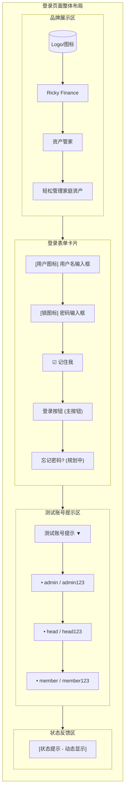
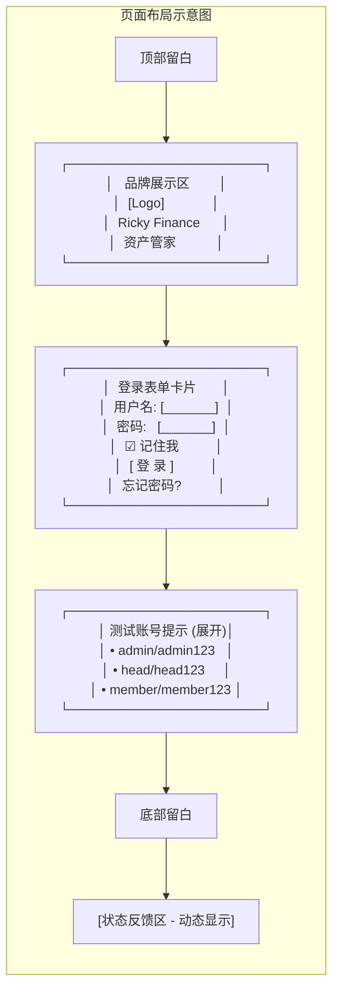
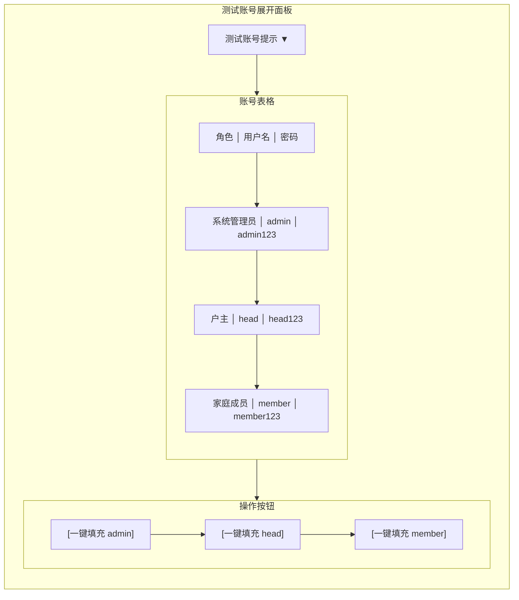
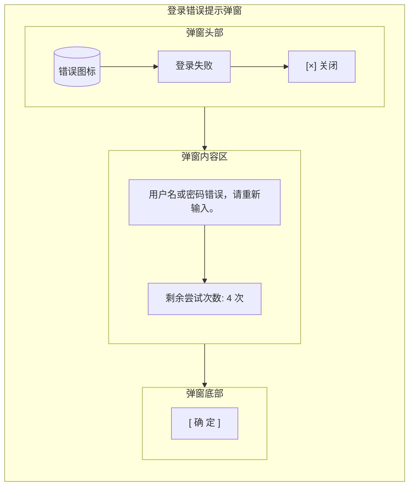
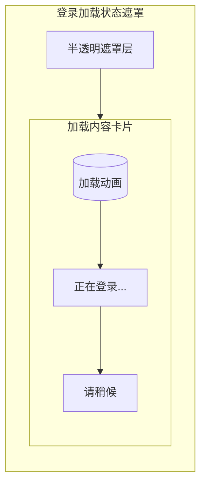

# 用户认证与权限管理需求文档

## 1. 文档信息

- **所属项目**: Ricky Finance - 资产管家
- **文档版本**: v2.1
- **创建日期**: 2026-05-31
- **最后更新**: 2026-05-31
- **返回总目录**: [总需求文档](../../../../需求文档.md)

---

## 目录

- [2. 用户角色与登录](#2-用户角色与登录)
  - [2.1 支持的用户角色](#21-支持的用户角色)
  - [2.2 默认测试账号](#22-默认测试账号)
  - [2.3 登录功能](#23-登录功能)
- [3. 权限控制](#3-权限控制)
  - [3.1 系统管理员权限](#31-系统管理员权限)
  - [3.2 户主权限](#32-户主权限)
  - [3.3 家庭成员权限](#33-家庭成员权限)
- [4. 界面设计](#4-界面设计)
  - [4.1 登录页面设计](#41-登录页面设计)

---

## 2. 用户角色与登录

### 2.1 支持的用户角色

- 系统管理员
- 户主
- 家庭成员

### 2.2 默认测试账号

| 角色 | 用户名 | 密码 |
|------|--------|------|
| 系统管理员 | admin | admin123 |
| 户主 | head | head123 |
| 家庭成员 | member | member123 |

### 2.3 登录功能

- 登录状态保持
- 安全退出功能

---

## 3. 权限控制

### 3.1 系统管理员权限

- 可查看所有户主、家庭成员的信息
- 可查看所有家庭的资产数据
- 可管理系统配置
- 不可直接修改家庭数据(仅查看)

### 3.2 户主权限

- 可管理(增加、编辑、删除)家庭成员
- 可查看和管理本家庭所有成员的资产数据
- 可添加、编辑、删除资产记录
- 可查看家庭资产分析报告

### 3.3 家庭成员权限

- 仅查看自己的资产数据
- 可添加自己的资产记录
- 可编辑自己的资产记录

> **数据可见性说明**：成员录入的资产记录会自动对户主可见（通过 `family_id` 关联）。详细的数据流转机制和实现原理，参见 **[03_资产记录与类型管理 §2.2.1 多角色数据可见性规则](03_资产记录与类型管理.md#221-多角色数据可见性规则)** 和 **[数据流转设计文档](../02_design/05_数据流转设计.md)**。

---

## 4. 界面设计

### 4.1 登录页面设计

#### 设计规范应用

- **色彩系统**: 使用深色主题 (#1a1a2e) 作为主背景
- **卡片设计**: 登录表单使用中深色 (#16213e) 卡片背景
- **按钮设计**: 主按钮使用强调色 (#a78bfa)
- **文字颜色**: 主文字使用白色/浅灰 (#eaeaea)，辅助文字使用灰色 (#8b8b8b)

#### 页面功能模块

1. **品牌展示区**
   - 应用 Logo（可选）
   - 应用名称：Ricky Finance - 资产管家
   - 简短标语：轻松管理家庭资产

2. **登录表单卡片**
   - 用户名输入框（带图标）
   - 密码输入框（带图标和显示/隐藏切换）
   - 记住我复选框
   - 登录按钮（主按钮样式）
   - 忘记密码链接（规划中）

3. **测试账号提示区**
   - 可折叠区域，显示默认测试账号信息
   - 一键填充功能（可选）

4. **状态反馈区**
   - 登录成功/失败提示
   - 加载状态指示器

#### 页面布局

#### 交互细节

1. **输入框交互**
   - 输入框聚焦时边框高亮为强调色 (#a78bfa)
   - 输入错误时边框变为红色 (#f87171) 并显示错误提示
   - 密码输入框支持显示/隐藏切换（眼睛图标）

2. **按钮交互**
   - 登录按钮悬停时背景色加深
   - 点击时按钮有缩放反馈动画
   - 加载状态显示加载图标并禁用按钮

3. **表单验证**
   - 实时验证用户名和密码格式
   - 登录失败时显示友好的错误信息
   - 支持回车键提交表单

4. **记住我功能**
   - 勾选后保存用户名（不保存密码）
   - 下次登录时自动填充用户名

5. **测试账号提示**
   - 默认折叠，点击展开显示
   - 每个账号提供一键填充按钮（可选）

#### 响应式设计

- **桌面端**: 居中布局，登录表单固定宽度
- **平板端**: 自适应宽度，保持居中
- **移动端**: 全宽布局，优化输入体验

#### 二级功能窗口设计

##### 测试账号展开面板

##### 登录错误提示弹窗

##### 登录加载状态遮罩

