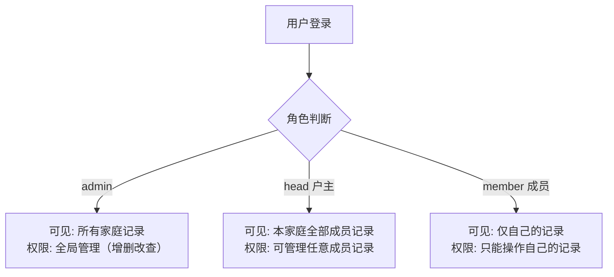
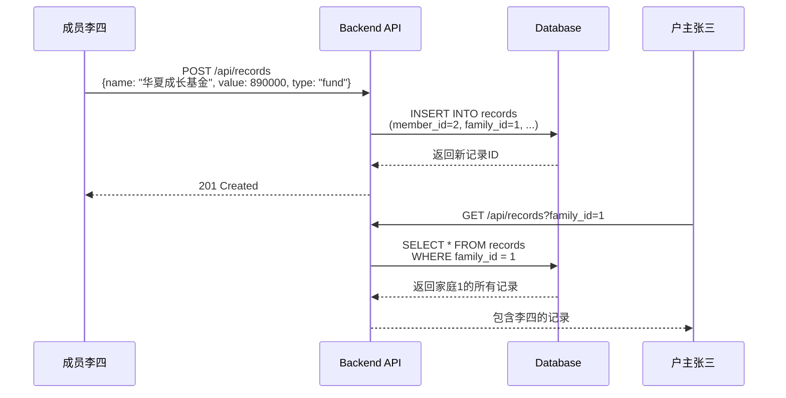
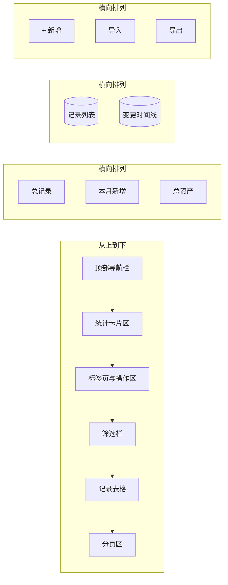
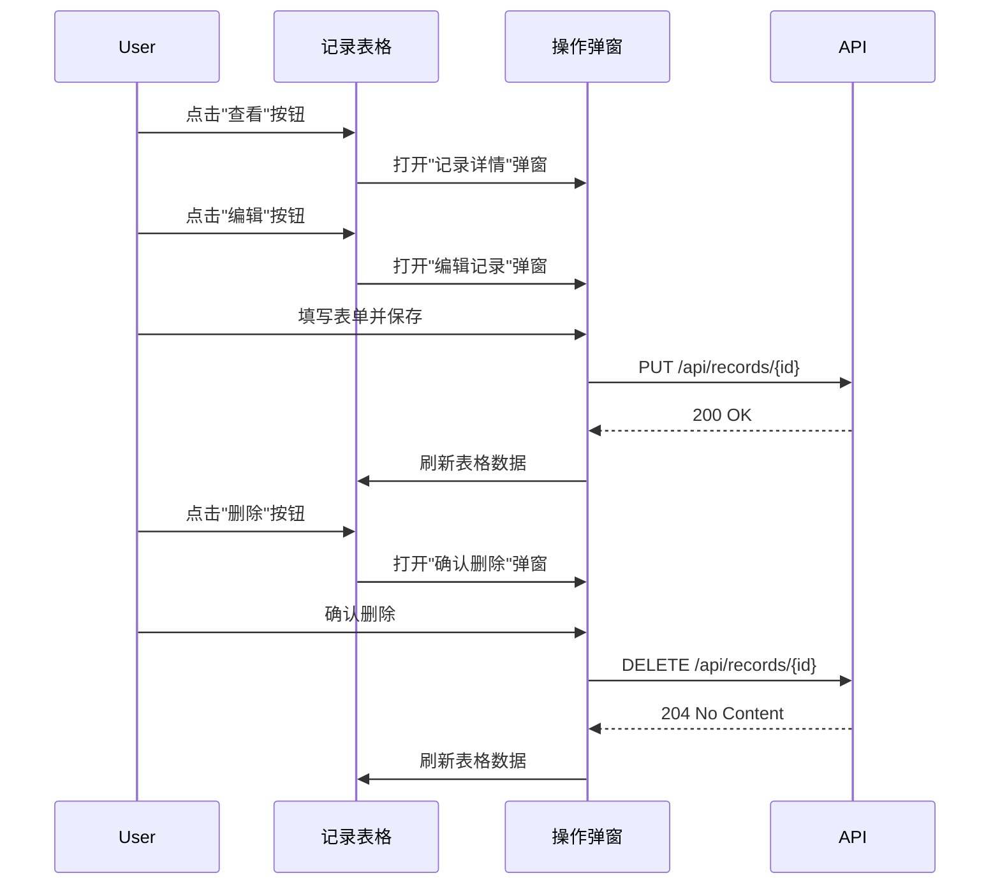
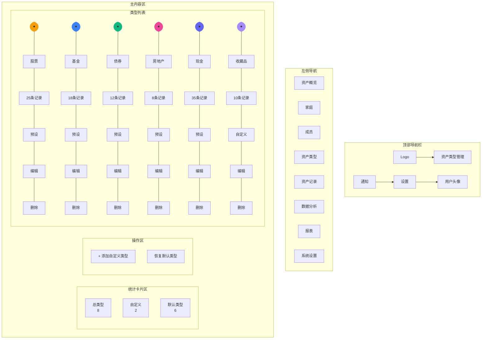
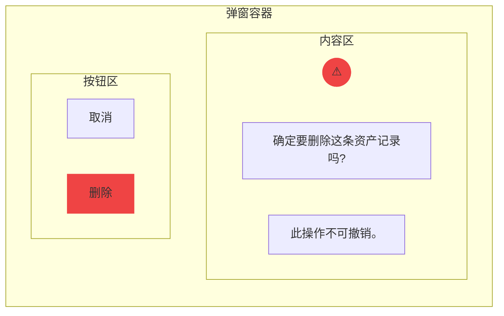

```mermaid
graph TB
    subgraph 顶部导航栏
        A1[Logo] --> A2[资产记录]
        A3[通知] --> A4[设置] --> A5[用户头像]
    end
    
    subgraph 左侧导航
        B1[资产概览]
        B2[家庭]
        B3[成员]
        B4[资产类型]
        B5[资产记录]
        B6[数据分析]
        B7[报表]
        B8[系统设置]
    end
    
    subgraph 主内容区
        subgraph 统计卡片区
            C1[总记录<br/>156]
            C2[本月新增<br/>+12]
            C3[总资产<br/>¥156.8万]
        end
        
        subgraph 标签页与操作区
            D1[记录列表]
            D2[变更时间线]
            D3[+ 新增]
            D4[导入]
            D5[导出]
        end
        
        subgraph 筛选栏
            E1[成员: 全部▼]
            E2[类型: 全部▼]
            E3[资产名称: 全部▼]
            E4[日期范围]
            E5[搜索...]
        end
        
        subgraph 记录表格
            F1[成员]
            F2[类型]
            F3[资产名称]
            F4[价值]
            F5[日期]
            F6[操作]
        end
        
        subgraph 分页区
            G1[←]
            G2[1]
            G3[2]
            G4[3]
            G5[→]
            G6[每页: 20 ▼]
        end
    end
    
    style A1 fill:#16213e,stroke:#2d3a5a
    style A2 fill:#16213e,stroke:#2d3a5a
    style B1 fill:#1a1a2e,stroke:#2d3a5a
    style C1 fill:#16213e,stroke:#2d3a5a
    style D1 fill:#16213e,stroke:#a78bfa
    style E1 fill:#16213e,stroke:#2d3a5a
    style F1 fill:#0f3460,stroke:#2d3a5a
```

# 资产记录与类型管理需求文档

## 1. 文档信息

- **所属项目**: Ricky Finance - 资产管家
- **文档版本**: v2.3
- **创建日期**: 2026-05-31
- **最后更新**: 2026-05-31
- **返回总目录**: [总需求文档](../../../../需求文档.md)

---

## 目录

- [2. 资产记录管理](#2-资产记录管理)
  - [2.1 资产记录字段](#21-资产记录字段)
  - [2.2 资产记录功能](#22-资产记录功能)
  - [2.3 记录筛选与搜索](#23-记录筛选与搜索)
  - [2.4 变更时间线](#24-变更时间线)
- [3. 资产类型管理](#3-资产类型管理)
  - [3.1 资产类型定义](#31-资产类型定义)
  - [3.2 预设资产类型(引导选项)](#32-预设资产类型引导选项)
  - [3.3 资产类型管理功能(户主权限)](#33-资产类型管理功能户主权限)
- [4. 界面设计](#4-界面设计)
  - [4.1 资产记录页](#41-资产记录页)
  - [4.2 资产类型管理页(户主)](#42-资产类型管理页户主)
  - [4.3 二级功能窗口设计](#43-二级功能窗口设计)

---

## 2. 资产记录管理

### 2.1 资产记录字段

| 字段名 | 类型 | 必填 | 说明 |
|--------|------|------|------|
| id | 数字 | 是 | 记录唯一标识 |
| memberId | 数字 | 是 | 关联家庭成员ID |
| familyId | 数字 | 是 | 所属家庭ID |
| type | 字符串 | 是 | 资产类型 |
| name | 字符串 | 是 | 资产名称（输入时支持自动补全，从用户历史记录中匹配） |
| value | 数字 | 是 | 资产价值(元) |
| date | 日期 | 是 | 记录日期 |
| status | 字符串 | 否 | 记录状态：valid(有效) / pending(待审核) / invalid(无效)，默认为 valid |
| note | 文本 | 否 | 备注说明 |
| createdAt | 日期时间 | 是 | 创建时间 |

> **已移除字段**: `previousValue`（上期价值）已在 v2.3 版本中移除，不再作为资产记录的数据要素。

### 2.2 资产记录功能

- **新增记录**: 手动录入单条资产记录
- **编辑记录**: 修改已有记录
- **删除记录**: 删除单条记录
- **查看记录详情**: 查看记录的完整信息
- **资产名称自动补全**（v2.3 新增）: 用户在填写资产名称时，系统自动从后端拉取该用户（或户主视角下本家庭所有成员）曾经使用过的资产名称作为可选项，提升录入效率和名称一致性
- **批量导入** (可选/后续规划): 支持Excel/CSV文件批量导入资产记录 - 高级功能，优先级较低

#### 2.2.1 新增记录的角色权限规则

| 角色 | 是否允许新增 | 成员选择 | 说明 |
|------|-------------|---------|------|
| admin（管理员） | ✅ 是 | **必须选择** | 管理员可以为任意成员添加记录，必须在表单中选择目标成员 |
| head（户主） | ✅ 是 | 可选 | 户主可以为自己或家庭成员添加记录，未选择时默认添加给自己 |
| member（成员） | ✅ 是 | 不可选 | 成员只能为自己添加记录，系统自动使用当前用户 |

#### 2.2.2 资产名称自动补全

用户在新增/编辑资产记录弹窗中填写"资产名称"时，系统应提供智能自动补全功能：

**功能行为**：
1. 用户聚焦"资产名称"输入框时，下拉展示该用户历史使用过的资产名称列表（去重，按最近使用时间排序）
2. 用户输入文字时，实时过滤匹配的资产名称
3. 用户可直接选择下拉列表中的名称，也可手动输入新的资产名称
4. 户主视角下，自动补全列表应包含本家庭所有成员的历史资产名称

**数据来源**：
```
用户输入资产名称
    │
    ▼
前端调用 API（聚焦时 / 输入时带防抖）
    │
    ▼
GET /api/records/asset-names?keyword=xxx
    │
    ▼
后端查询（按角色权限过滤）：
  SELECT DISTINCT name FROM records
  WHERE (角色权限过滤条件)
    AND name LIKE '%keyword%'
  ORDER BY MAX(created_at) DESC
  LIMIT 10
    │
    ▼
返回: ["招商银行股票", "贵州茅台股票", "华夏成长基金", ...]
    │
    ▼
前端渲染下拉列表，用户点击选择或继续输入
```

**交互规范**：
- 下拉列表最多展示 10 条
- 匹配文字高亮显示
- 键盘上下键选择，回车确认
- 点击列表外区域关闭下拉

**后端需新增 API**：`GET /api/records/asset-names?keyword=xxx`
- 权限控制：admin 返回全局，head 返回本家庭，member 返回自己的
- 支持模糊搜索（keyword 参数可选）
- 返回去重、按最近使用时间倒序排列的资产名称数组

> 完整的技术实现细节（API 接口规范）详见 **[08_后端技术设计规范 §5.5 资产记录](08_技术与附录需求.md#55-资产记录-apirecords)** 和 **[数据流转设计文档](../02_design/05_数据流转设计.md)**。
- **批量导出** (可选/后续规划): 支持Excel/CSV格式导出数据 - 高级功能，优先级较低

#### 2.2.1 多角色数据可见性规则

资产记录的数据可见性遵循"家庭隔离 + 角色分层"原则：



**核心场景：成员录入 → 户主可见**



**可见性实现原理**：

| 步骤 | 说明 |
|------|------|
| ① 写入时关联家庭 | 成员新增记录时，后端自动从 `members` 表获取该成员的 `family_id`，写入 `records.family_id` 字段 |
| ② 查询时按家庭过滤 | 户主查询记录时，后端添加 `WHERE r.family_id = ?` 条件，`?` 为户主所属家庭的 ID |
| ③ 前端不过滤成员 | records.html 默认不传 `memberId` 参数，因此户主默认看到本家庭全部成员的记录 |
| ④ 成员筛选下拉 | 户主可通过"成员筛选"下拉框，选择仅查看特定成员的记录（传入 `memberId` 参数） |

> 完整的技术实现细节（后端 SQL 查询逻辑、权限中间件、数据隔离策略）详见 **[08_后端技术设计规范 §3.4 跨模块数据关联总览](08_技术与附录需求.md#34-跨模块数据关联总览)** 和 **[08_后端技术设计规范 §7.3 数据隔离策略](08_技术与附录需求.md#73-数据隔离策略)**。

### 2.3 记录筛选与搜索

- 按家庭成员筛选
- 按资产类型筛选(包括自定义类型)
- 按资产名称筛选(下拉选择，调用后端获取已登记的资产名称)
- 按日期范围筛选
- 关键词搜索(成员名、资产名称)

**资产名称筛选说明**：
- 下拉选择框，选项来自用户已登记的资产记录
- 后端 API：`GET /api/records/asset-names`
- 权限控制：admin 返回全局，head 返回本家庭，member 返回自己的
- 支持模糊搜索（keyword 参数可选）
- 返回去重、按最近使用时间倒序排列的资产名称数组

### 2.4 变更时间线

- 以时间轴形式展示资产变更历史
- 突出显示增长/下降趋势
- 支持查看每次变更的详细信息

---

## 3. 资产类型管理

### 3.1 资产类型定义

- 资产类型为可自定义项，系统提供预设选项作为引导
- 户主可自定义添加、编辑、删除资产类型
- 每个资产类型包含:类型标识、显示名称、颜色

### 3.2 预设资产类型(引导选项)

| 类型值 | 显示名称 | 颜色 |
|--------|----------|------|
| stock | 股票 | #f59e0b |
| fund | 基金 | #3b82f6 |
| bond | 债券 | #10b981 |
| realestate | 房地产 | #ec4899 |
| cash | 现金 | #6366f1 |
| other | 其他 | #6b7280 |

### 3.3 资产类型管理功能(户主权限)

- 添加自定义资产类型
- 编辑已有资产类型(名称、颜色)
- 删除自定义资产类型(检查是否有记录使用)
- 恢复默认预设类型

---

## 4. 界面设计

### 4.1 资产记录页

#### 设计规范应用

- **色彩系统**: 主背景 #1a1a2e，卡片背景 #16213e
- **文字颜色**: 主文字 #eaeaea，辅助文字 #8b8b8b
- **数值颜色**: 正数/增长 #4ade80，负数/下降 #f87171，中性 #60a5fa
- **标签页设计**: 激活标签使用强调色 #a78bfa
- **表格设计**: 行悬停高亮，交替行背景色，数字右对齐

#### 页面功能模块

1. **记录统计卡片**
   - 总记录数（卡片1：数字 + 图标）
   - 本月新增记录数（卡片2：数字 + 趋势箭头）
   - 总资产价值（卡片3：数字 + 货币符号）
   - 统计卡片使用中深色背景，数字大号字体

2. **标签页切换区**
   - 记录列表标签（默认激活）
   - 变更时间线标签
   - 激活标签下划线使用强调色 #a78bfa

3. **快速操作区**
   - 新增记录按钮（主按钮样式）
   - 导入按钮（次要按钮）
   - 导出按钮（次要按钮）

4. **记录列表区（标签页1）**
   - 筛选栏（卡片样式）：
     - 成员筛选：下拉选择
     - 资产类型筛选：下拉选择（带颜色预览）
     - 日期范围：开始日期 - 结束日期
     - 关键词搜索：输入框
   - 记录表格：
     - 成员（左对齐，显示头像）
     - 资产类型（左对齐，带颜色圆点）
     - 资产名称（左对齐）
     - 价值（右对齐）
     - 日期（左对齐）
     - 操作列：查看、编辑、删除
   - 表格支持排序、分页

5. **变更时间线（标签页2）**
   - 按时间倒序展示
   - 时间轴样式
   - 每次变更显示：
     - 时间点
     - 成员头像+姓名
     - 资产名称+类型
     - 变更后价值
     - 变更时间

#### 页面布局





#### 交互细节



### 4.2 资产类型管理页(户主)

#### 设计规范应用

- **色彩系统**: 主背景 #1a1a2e，卡片背景 #16213e
- **类型颜色**: 每个资产类型有专属颜色圆点
- **按钮样式**: 主按钮使用强调色 #a78bfa
- **警告提示**: 删除有记录的类型时显示红色警告

#### 页面功能模块

1. **资产类型统计卡片**
   - 总类型数（卡片1）
   - 自定义类型数（卡片2）
   - 默认类型数（卡片3）
   - 统计卡片横向排列

2. **操作区**
   - 添加自定义类型按钮（主按钮）
   - 恢复默认类型按钮（次要按钮，带警告）

3. **类型列表区**
   - 每个类型项卡片包含：
     - 颜色预览圆点
     - 类型名称（主文字）
     - 使用记录数（辅助文字）
     - 预设标识（默认类型显示"预设"标签）
     - 操作按钮：编辑、删除
   - 类型项卡片使用响应式网格布局

#### 页面布局



#### 交互细节

```mermaid
flowchart TD
    A[点击删除按钮] --> B{有记录使用?}
    B -->|是| C[显示警告弹窗<br/>'该类型有X条记录使用<br/>删除后将变为"其他"'<br/>[取消] [删除]]
    B -->|否| D[显示确认弹窗<br/>'确定要删除该类型吗?'<br/>[取消] [删除]]
    C -->|确认删除| E[调用API删除]
    D -->|确认删除| E
    E --> F[刷新类型列表]
    E --> G[提示删除成功]
```

### 4.3 二级功能窗口设计

#### 4.3.1 新增/编辑资产记录弹窗

```mermaid
flowchart LR
    subgraph 弹窗容器
        subgraph 标题栏
            A[新增资产记录]
        end
        
        subgraph 表单区
            B1[成员: ▼ 选择家庭成员]
            B2[资产类型: ▼ 选择类型 ●●●]
            B3[资产名称: _________________________ ▼ 自动补全]
            B4[资产价值: ¥ ________________________]
            B5[记录日期: __________ 📅]
            B6[状态: ▼ 有效/待审核/无效]
            B7[备注: __________________________]
        end
        
        subgraph 按钮区
            C1[取消]
            C2[确认保存]
        end
    end
    
    style A fill:#16213e,stroke:#2d3a5a
    style B1 fill:#0f3460,stroke:#2d3a5a
    style C2 fill:#a78bfa,stroke:#a78bfa
```



**设计说明**
- **弹窗尺寸**: 宽度520px，高度自适应
- **标题区域**: 背景色 #16213e，标题文字 18px 加粗 #eaeaea
- **表单区域**: 背景色 #0f3460，内边距 24px
- **表单字段布局**: 垂直排列，标签左对齐，输入框宽度 100%
- **输入框样式**: 圆角 8px，边框 1px #2d3a5a，聚焦时边框 #a78bfa
- **按钮区域**: 底部居中，取消按钮次要样式，确认按钮主样式

#### 4.3.2 查看记录详情弹窗

```mermaid
flowchart LR
    subgraph 弹窗容器
        subgraph 标题栏
            A[资产记录详情]
        end
        
        subgraph 内容区
            subgraph 成员信息
                B1([头像])
                B2[成员: 张三]
            end
            
            subgraph 信息表格
                C1[类型] --> C2[[●] 股票]
                C3[名称] --> C4[腾讯控股]
                C5[价值] --> C6[¥12,500.00]
                C7[日期] --> C8[2026-05-28]
                C9[状态] --> C10[有效]
                C11[备注] --> C12[长期持有]
            end
            
            D[创建时间: 2026-05-28 14:30:00]
        end
        
        subgraph 按钮区
            E1[关闭]
            E2[编辑记录]
        end
    end
    
    style A fill:#16213e,stroke:#2d3a5a
    style C8 fill:#4ade80,stroke:#4ade80
```

**设计说明**
- **弹窗尺寸**: 宽度480px，高度自适应
- **信息卡片**: 两列布局，标签列宽度 80px，内容列宽度自适应
- **头像区域**: 顶部左侧显示成员头像，右侧显示成员名称
- **变化率显示**: 正数绿色带向上箭头，负数红色带向下箭头
- **创建时间**: 底部灰色小字显示

#### 4.3.3 添加/编辑资产类型弹窗

```mermaid
flowchart LR
    subgraph 弹窗容器
        subgraph 标题栏
            A[新增资产类型]
        end
        
        subgraph 表单区
            B1[类型名称: _________________________]
            subgraph 颜色选择
                C1([●]) C2([●]) C3([●]) C4([●]) C5([●])
                C6([●]) C7([●]) C8([●]) C9([●]) C10([●])
                C11([●]) C12([●]) C13([●]) C14([●]) C15([●])
            end
            D1[自定义颜色 ▼]
            B2[类型标识: stock_collection 自动生成]
        end
        
        subgraph 按钮区
            E1[取消]
            E2[确认保存]
        end
    end
    
    style A fill:#16213e,stroke:#2d3a5a
    style B1 fill:#0f3460,stroke:#2d3a5a
    style E2 fill:#a78bfa,stroke:#a78bfa
```

**设计说明**
- **弹窗尺寸**: 宽度420px，高度自适应
- **颜色选择器**: 3行5列预设颜色圆点，点击选中高亮
- **自定义颜色**: 支持通过颜色选择器选取任意颜色
- **类型标识**: 自动根据名称生成，不可编辑

#### 4.3.4 确认删除弹窗



**设计说明**
- **弹窗尺寸**: 宽度400px，高度 220px
- **警告图标**: 红色圆形背景，白色感叹号
- **标题文字**: 16px 加粗 #eaeaea
- **说明文字**: 14px #8b8b8b
- **删除按钮**: 危险按钮样式，红色背景

#### 4.3.5 批量操作结果弹窗

```mermaid
flowchart LR
    subgraph 弹窗容器
        subgraph 标题栏
            A[操作完成]
        end
        
        subgraph 内容区
            B([✓])
            C[批量导入完成]
            
            subgraph 结果统计
                D1[成功导入: 25 条记录]
                D2[跳过记录: 3 条 格式错误]
                D3[失败记录: 0 条]
            end
        end
        
        subgraph 按钮区
            E1[查看详情]
            E2[关闭]
        end
    end
    
    style A fill:#16213e,stroke:#2d3a5a
    style B fill:#4ade80,stroke:#4ade80
```



**设计说明**
- **弹窗尺寸**: 宽度450px，高度自适应
- **结果统计**: 列表展示成功、跳过、失败数量
- **操作按钮**: 可查看详情或直接关闭
- **成功图标**: 绿色圆形背景，白色对勾

#### 4.3.6 变更详情弹窗(时间线)

```mermaid
flowchart LR
    subgraph 弹窗容器
        subgraph 标题栏
            A[变更详情]
        end
        
        subgraph 内容区
            B1[时间: 2026-05-28 14:30:00]
            
            subgraph 操作人信息
                B2([头像])
                B3[操作人: 张三]
            end
            
            C1[资产: 腾讯控股 股票]
            C2[变更类型: 编辑记录]
            
            subgraph 变更对比
                D1[变更前] --> D2[¥11,880.00]
                D3[变更后] --> D4[¥12,500.00]
            end
            
            E[+5.2% ↑ ¥620]
        end
        
        subgraph 按钮区
            F[关闭]
        end
    end
    
    style A fill:#16213e,stroke:#2d3a5a
    style E fill:#4ade80,stroke:#4ade80
```



**设计说明**
- **弹窗尺寸**: 宽度460px，高度自适应
- **变更对比**: 双栏对比展示变更前后数值
- **变更类型标签**: 新增/编辑/删除，不同颜色区分
- **变化率**: 居中显示，大字突出

#### 4.3.7 通用弹窗设计规范

| 组件 | 样式规范 |
|------|----------|
| **弹窗遮罩** | 半透明黑色背景 rgba(0,0,0,0.6) |
| **弹窗容器** | 圆角 16px，阴影 0 20px 60px rgba(0,0,0,0.5) |
| **弹窗标题** | 18px 加粗 #eaeaea，padding 20px 24px |
| **弹窗内容区** | 背景色 #16213e，padding 24px |
| **按钮区域** | 背景色 #0f3460，padding 16px 24px，flex 布局 |
| **输入框** | 高度 44px，圆角 8px，边框 1px #2d3a5a |
| **主按钮** | 背景色 #a78bfa，文字白色，圆角 8px |
| **次要按钮** | 背景色 #2d3a5a，文字 #eaeaea，圆角 8px |
| **危险按钮** | 背景色 #ef4444，文字白色，圆角 8px |

---

## 5. 数据流转说明

> 本章中所有资产记录的录入、变更、展示操作，其完整的数据流转链路（前端 → 后端 → 数据库 → 返回 → 页面刷新、跨角色可见性）已统一收拢至 **[数据流转设计文档](../02_design/05_数据流转设计.md)**。

**快速索引**：

| 场景 | 文档章节 |
|------|---------|
| 新增/编辑/删除记录的完整闭环 | [§2 资产记录 CRUD 闭环](../02_design/05_数据流转设计.md#2-资产记录-crud-闭环) |
| 成员录入后户主可见 | [§4 跨角色数据可见性](../02_design/05_数据流转设计.md#4-跨角色数据可见性) |
| 操作后本页面表格刷新机制 | [§2.3 前端 UI 更新闭环](../02_design/05_数据流转设计.md#23-前端-ui-更新闭环) |
