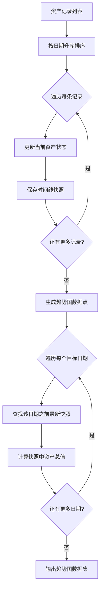
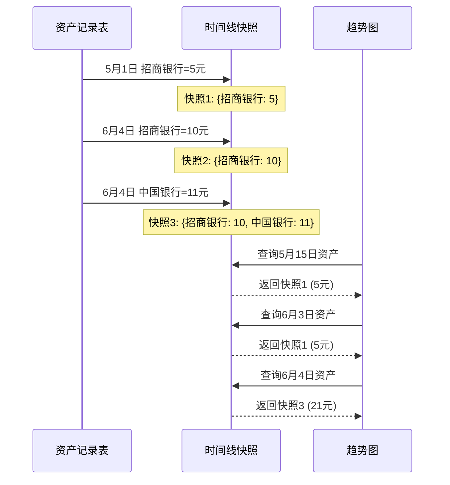

# 资产概览与数据分析需求文档

## 1. 文档信息

- **所属项目**: Ricky Finance - 资产管家
- **文档版本**: v2.0
- **创建日期**: 2026-05-31
- **最后更新**: 2026-05-31
- **返回总目录**: [总需求文档](../../../../需求文档.md)

---

## 目录

- [2. 关键指标统计](#2-关键指标统计)
  - [2.1 户主视角](#21-户主视角)
  - [2.2 系统管理员视角](#22-系统管理员视角)
- [3. 数据可视化](#3-数据可视化)
  - [3.1 资产趋势图](#31-资产趋势图)
  - [3.2 资产配置图](#32-资产配置图)
  - [3.3 可定制化仪表盘](#33-可定制化仪表盘)
- [4. 界面设计](#4-界面设计)
  - [4.1 资产概览页](#41-资产概览页)
  - [4.2 数据分析页](#42-数据分析页)

---

## 2. 关键指标统计

### 2.1 户主视角（更新版 v2.5）

- **家庭总资产价值及变化率**：按「成员+资产名称」组合去重，仅统计每个组合的最新一期记录的价值总和
  - **计算逻辑示例**：
    - 成员A 1月记录"招商银行"余额：10元
    - 成员A 2月记录"招商银行"余额：30元（工资进账后更新）
    - 成员B 2月记录"招商银行"余额：20元
    - 统计结果：成员A招商银行 30元 + 成员B招商银行 20元 = 50元
    - 总资产 = 每个成员的每个资产名称最新记录价值之和
  - 详见 [03_资产记录 §2.5](03_资产记录与类型管理.md#25-同一资产名称的记录更新规则)
- 家庭成员数及活跃成员数
- 家庭资产记录总数
- 本月新增记录数
- 待处理记录数

### 2.2 系统管理员视角（更新版 v2.5）

- **系统总资产价值**：按「成员+资产名称」组合去重，仅统计每个组合的最新一期记录的价值总和
  - 计算逻辑同户主视角，统计范围为全系统所有家庭的所有成员
  - 详见 [03_资产记录 §2.5](03_资产记录与类型管理.md#25-同一资产名称的记录更新规则)
- 家庭总数
- 成员总数
- 系统资产记录总数

---

## 3. 数据可视化

### 3.1 资产趋势图

- 折线图展示资产总值随时间的变化
- 支持查看近1个月/3个月/6个月/1年/全部数据
- 展示总体增长/下降趋势

#### 3.1.1 资产趋势图数据计算规则（v2.5 新增）

**核心原则**：趋势图的每个数据点应显示该日期之前（含当天）所有成员的所有资产的最新值之和。

**业务场景示例**：

```
用户记录历史：
┌────┬────────────┬──────────┬────────┬────────────┐
│ id │ member_id │ name     │ value  │ date       │
├────┼────────────┼──────────┼────────┼────────────┤
│ 1  │ 1          │ 招商银行  │ 5元    │ 2026-05-01 │
│ 2  │ 1          │ 招商银行  │ 10元   │ 2026-06-04 │ ← 更新同一资产
│ 3  │ 1          │ 中国银行  │ 11元   │ 2026-06-04 │ ← 新增资产
│ 4  │ 2          │ 招商银行  │ 20元   │ 2026-05-15 │ ← 其他成员
└────┴────────────┴──────────┴────────┴────────────┘

趋势图数据点计算结果：
┌────────────┬───────────────────────────────────┬──────────┐
│ 日期       │ 资产快照                          │ 总资产   │
├────────────┼───────────────────────────────────┼──────────┤
│ 2026-05-01 │ {1_招商银行: 5}                    │ 5元      │
│ 2026-05-15 │ {1_招商银行: 5, 2_招商银行: 20}    │ 25元     │
│ 2026-06-03 │ {1_招商银行: 5, 2_招商银行: 20}    │ 25元     │ ← 继承前一日
│ 2026-06-04 │ {1_招商银行: 10, 1_中国银行: 11, 2_招商银行: 20} │ 41元     │ ← 更新后
└────────────┴───────────────────────────────────┴──────────┘

关键规则：
✅ 正确：使用「member_id_name」作为分组键，不同成员的同名资产独立计算
❌ 错误：仅使用「name」作为分组键，不同成员的同名资产会互相覆盖
```

**计算逻辑**：

1. **构建时间线快照**：按日期升序处理所有记录，为每个有记录的日期保存一份资产快照
2. **资产更新规则**：以「member_id_name」作为唯一键，后登记的覆盖先登记的
3. **无记录日期继承**：对于没有新记录的日期，使用最近的资产快照
4. **总资产计算**：将快照中所有资产的最新值求和

**数据流转图**：



**时间线快照示意图**：



**适用场景**：
- 资产趋势折线图的每个数据点
- 历史资产水平回溯查询
- 资产增长/下降趋势分析

### 3.2 资产配置图

- 饼图展示各类资产的占比
- 直观显示资产分布情况（支持自定义类型）

### 3.3 可定制化仪表盘

- 支持添加多种类型的图表
- 图表位置可拖拽调整
- 图表大小可自定义
- 支持删除不需要的图表

---

## 4. 界面设计

### 4.1 资产概览页

#### 设计规范应用

- **色彩系统**: 主背景 #1a1a2e，卡片背景 #16213e
- **文字颜色**: 主文字 #eaeaea，辅助文字 #8b8b8b
- **数值颜色**: 增长 #4ade80（绿色），下降 #f87171（红色），中性 #60a5fa（蓝色）
- **图表配色**: 使用预设的资产类型颜色
- **强调色**: 按钮和高亮元素使用 #a78bfa（紫色）

#### 页面功能模块

1. **顶部统计区**
   - 总资产卡片：
     - 大号字体显示当前总资产
     - 环比变化率（带箭头，绿色上升/红色下降）
     - 显示变化金额
     - 卡片背景使用强调色渐变
   - 家庭成员数卡片：
     - 显示总成员数
     - 显示活跃成员数（有资产记录）
     - 显示成员头像缩略图
   - 资产记录总数卡片：
     - 显示总记录数
     - 显示本月新增数
   - 本月新增记录卡片：
     - 显示新增数量
     - 显示环比变化

2. **图表展示区**
   - 资产趋势折线图：
     - 支持时间范围切换（1月/3月/6月/1年/全部）
     - 鼠标悬停显示具体数值
     - 显示趋势线和数据点
     - 图表容器使用卡片背景
   - 资产配置饼图：
     - 按资产类型分类展示
     - 每个扇区使用对应的类型颜色
     - 图例显示类型名称和占比
     - 支持点击扇区查看详细记录
   - 家庭成员资产占比条形图：
     - 横向条形图展示各成员资产
     - 条形颜色区分不同成员
     - 鼠标悬停显示具体金额

3. **快速操作区**
   - 新增资产记录按钮（主按钮样式）
   - 查看报告快捷入口
   - 数据导出快捷入口

4. **家庭成员资产概览区**
   - 成员列表卡片：
     - 成员头像（圆形）
     - 成员姓名
     - 角色标识（户主/成员）
     - 资产总额（大号字体）
     - 记录数
     - 快速操作按钮（查看详情/新增记录）

#### 页面布局（户主视角）

```
┌─────────────────────────────────────────────────────────────────────┐
│  [Logo]  资产概览                    [通知] [设置] [用户头像]  │
├──────────┬──────────────────────────────────────────────────────────┤
│          │  ┌──────────────────┐ ┌──────────┐ ┌──────────┐ ┌─────┐│
│  资产    │  │   家庭总资产     │ │ 家庭成员│ │ 总记录  │ │本月 ││
│  概览    │  │  ¥125,800.00    │ │    5     │ │   156   │ │ +12 ││
│          │  │    +5.2% ↑       │ │活跃: 3  │ │本月: 20 │ │     ││
│  家庭    │  └──────────────────┘ └──────────┘ └──────────┘ └─────┘│
│  成员    ├──────────────────────────────────────────────────────────┤
│          │  ┌─────────────────────────────────┐ ┌──────────────────┐│
│  资产    │  │      资产趋势折线图            │ │  资产配置饼图    ││
│  记录    │  │  [1月] [3月] [6月] [1年] [全部] │ │                  ││
│          │  │                                 │ │  [图例]          ││
│  数据    │  └─────────────────────────────────┘ └──────────────────┘│
│  分析    ├──────────────────────────────────────────────────────────┤
│          │  [+ 新增资产记录]  [查看报告]  [导出数据]               ││
│  报表    ├──────────────────────────────────────────────────────────┤
│          │  ┌──────────┐ ┌──────────┐ ┌──────────┐ ┌──────────┐   ││
│  系统    │  │ [头像]   │ │ [头像]   │ │ [头像]   │ │ [头像]   │   ││
│  设置    │  │ 张三     │ │ 李四     │ │ 王五     │ │ 赵六     │   ││
│          │  │ [户主]   │ │ [成员]   │ │ [成员]   │ │ [成员]   │   ││
│          │  │ ¥68,500 │ │ ¥42,300 │ │ ¥15,000 │ │ ¥0      │   ││
│          │  │ 25条记录 │ │ 18条记录 │ │ 10条记录 │ │ 0条记录 │   ││
│          │  │ [详情] [+] │ │ [详情] [+] │ │ [详情] [+] │ │ [详情] [+] │   ││
│          │  └──────────┘ └──────────┘ └──────────┘ └──────────┘   ││
└──────────┴──────────────────────────────────────────────────────────┘
```

#### 系统管理员版补充

- 统计区显示：
  - 系统家庭总数
  - 成员总数
  - 系统总资产
  - 本月活跃家庭数
- 图表展示区显示全系统资产分布
- 家庭列表区展示所有家庭的基本信息和总资产（表格形式）

#### 交互细节

1. **统计卡片交互**
   - 悬停时卡片有轻微上浮效果
   - 点击总资产卡片可查看详细趋势
   - 变化率数字有计数动画效果

2. **图表交互**
   - 资产趋势图：
     - 时间范围切换按钮悬停高亮
     - 鼠标悬停显示数据点详情
     - 支持缩放和平移
   - 资产配置饼图：
     - 扇区悬停时放大并高亮
     - 点击扇区跳转到资产记录页并筛选该类型
     - 图例可点击切换显示/隐藏
   - 成员资产条形图：
     - 条形悬停高亮
     - 点击条形查看该成员详情

3. **快速操作交互**
   - 新增资产记录按钮点击打开弹窗
   - 查看报告按钮跳转到报表导出页
   - 导出数据按钮打开导出配置弹窗

4. **成员卡片交互**
   - 成员卡片悬停阴影加深
   - 点击查看详情按钮打开成员详情弹窗
   - 点击+按钮快速为该成员新增记录

### 4.2 数据分析页

#### 设计规范应用

- **色彩系统**: 主背景 #1a1a2e，卡片背景 #16213e
- **图表组件**: 统一的图表容器样式
- **洞察卡片**: 重要洞察使用强调色背景
- **仪表盘网格**: 可拖拽调整的网格布局

#### 页面功能模块

1. **数据概览卡片**
   - 总资产变化趋势卡片
   - 各成员贡献占比卡片
   - 资产类型分布卡片
   - 卡片可拖拽排序

2. **可定制仪表盘**
   - 图表组件库侧边栏：
     - 趋势图组件
     - 饼图组件
     - 柱状图组件
     - 对比图组件
     - 排行榜组件
   - 支持拖拽添加图表到仪表盘
   - 图表大小可调整（小/中/大/超大）
   - 图表位置可拖拽交换
   - 支持删除图表
   - 支持保存仪表盘配置
   - 支持重置为默认布局

3. **智能洞察区**
   - 自动生成的资产分析摘要卡片
   - 异常变化提示卡片（红色警告）
   - 增长亮点提示卡片（绿色高亮）
   - 投资建议卡片（规划中）
   - 洞察卡片支持点击查看详情

#### 页面布局

```
┌─────────────────────────────────────────────────────────────────────┐
│  [Logo]  数据分析                    [通知] [设置] [用户头像]  │
├──────────┬──────────────────────────────────────────────────────────┤
│          │  ┌───────────────┐ ┌───────────────┐ ┌───────────────┐  │
│  资产    │  │  总资产趋势   │ │  成员贡献占比 │ │  资产类型分布 │  │
│  概览    │  │               │ │               │ │               │  │
│          │  └───────────────┘ └───────────────┘ └───────────────┘  │
│  家庭    ├──────────────────────────────────────────────────────────┤
│  成员    │  ┌─────────────────────────────────────────────────────┐ │
│          │  │  可定制仪表盘                          [+ 添加图表] │ │
│  资产    │  ├─────────────────────────────────────────────────────┤ │
│  记录    │  │  ┌───────────────────┐ ┌───────────────────┐        │ │
│          │  │  │   趋势图组件      │ │   饼图组件        │        │ │
│  数据    │  │  │                   │ │                   │        │ │
│  分析    │  │  └───────────────────┘ └───────────────────┘        │ │
│          │  │  ┌───────────────────────────────────────┐          │ │
│  报表    │  │  │         柱状图组件                   │          │ │
│          │  │  │                                       │          │ │
│  系统    │  │  └───────────────────────────────────────┘          │ │
│  设置    │  └─────────────────────────────────────────────────────┘ │
│          ├──────────────────────────────────────────────────────────┤
│          │  ┌─────────────────────────────────────────────────────┐ │
│          │  │  📊 智能洞察                                        │ │
│          │  ├─────────────────────────────────────────────────────┤ │
│          │  │  [绿色卡片] 本月资产增长 5.2%，表现良好！            │ │
│          │  │  [蓝色卡片] 股票类资产占比最高，建议关注风险分散      │ │
│          │  │  [黄色卡片] 成员王五本月无新增记录，提醒更新          │ │
│          │  └─────────────────────────────────────────────────────┘ │
└──────────┴──────────────────────────────────────────────────────────┘
```

#### 交互细节

1. **仪表盘定制交互**
   - 拖拽图表组件到仪表盘区域
   - 拖拽图表手柄调整大小
   - 拖拽图表标题栏调整位置
   - 点击图表右上角×删除
   - 点击保存配置按钮保存当前布局
   - 点击重置按钮恢复默认布局

2. **图表组件交互**
   - 每个图表组件支持单独配置（数据源、时间范围等）
   - 点击图表组件的设置图标打开配置弹窗
   - 图表数据支持刷新
   - 图表支持导出为图片

3. **智能洞察交互**
   - 洞察卡片点击展开详细分析
   - 异常提示卡片提供跳转链接查看相关记录
   - 支持关闭不重要的洞察
   - 洞察支持分享（复制文本）

4. **响应式设计**
   - 桌面端：多列网格布局
   - 平板端：自适应双列布局
   - 移动端：单列堆叠，简化图表展示

#### 二级功能窗口设计

##### 图表配置弹窗

```
┌─────────────────────────────────────────────────────────┐
│  [图表图标]  图表配置 - 资产趋势图          [×]      │
├─────────────────────────────────────────────────────────┤
│                                                         │
│  ┌─────────────────────────────────────────────────┐   │
│  │  图表类型                                       │   │
│  │  (●) 折线图    ( ) 柱状图    ( ) 面积图        │   │
│  └─────────────────────────────────────────────────┘   │
│                                                         │
│  ┌─────────────────────────────────────────────────┐   │
│  │  数据源配置                                     │   │
│  │  数据类型: [总资产 ▼]                         │   │
│  │  时间范围: [6个月 ▼] 或 自定义: [2025-11] - [2026-05]│
│  │  数据粒度: [按月 ▼]                             │   │
│  │  统计方式: (●) 总值  ( ) 平均值  ( ) 累计值     │   │
│  └─────────────────────────────────────────────────┘   │
│                                                         │
│  ┌─────────────────────────────────────────────────┐   │
│  │  显示选项                                       │   │
│  │  ☑ 显示数据标签                                 │   │
│  │  ☑ 显示图例                                     │   │
│  │  ☑ 显示趋势线                                   │   │
│  │  ☐ 显示网格线                                   │   │
│  │  图表标题: [资产趋势图____________]           │   │
│  └─────────────────────────────────────────────────┘   │
│                                                         │
├─────────────────────────────────────────────────────────┤
│   [取消]    [预览效果]    [保存配置]    [确认应用]  │
└─────────────────────────────────────────────────────────┘
```

##### 成员资产详情弹窗

```
┌─────────────────────────────────────────────────────────┐
│  [成员图标]  张三的资产详情          [×]  [导出数据] │
├─────────────────────────────────────────────────────────┤
│                                                         │
│  ┌─────────────────────────────────────────────────┐   │
│  │                                                 │   │
│  │              ┌───────────────┐                   │   │
│  │              │               │                   │   │
│  │              │     ZS        │   张三           │   │
│  │              │   (头像)      │   [户主标签]     │   │
│  │              │               │                   │   │
│  │              └───────────────┘   资产总额: ¥68,500  │   │
│  │                                                 │   │
│  └─────────────────────────────────────────────────┘   │
│                                                         │
│  ┌─────────────────────────────────────────────────┐   │
│  │  资产类型分布                                   │   │
│  │  ┌─────────────────────────────────────────────┐ │   │
│  │  │  [饼图: 股票 45% | 基金 30% | 债券 25%]   │ │   │
│  │  └─────────────────────────────────────────────┘ │   │
│  └─────────────────────────────────────────────────┘   │
│                                                         │
│  ┌─────────────────────────────────────────────────┐   │
│  │  资产记录列表 (按时间倒序)                        │   │
│  │  ┌─────────────────────────────────────────────┐ │   │
│  │  │ 日期       │ 类型  │ 名称       │ 价值     │ │   │
│  │  ├────────────┼───────┼────────────┼──────────┤ │   │
│  │  │ 2026-05-20 │ 股票  │ 腾讯股票   │ ¥25,000  │ │   │
│  │  │ 2026-05-15 │ 基金  │ 易方达蓝筹 │ ¥18,000  │ │   │
│  │  │ 2026-05-10 │ 债券  │ 国债       │ ¥15,000  │ │   │
│  │  │ ...        │ ...   │ ...        │ ...      │ │   │
│  │  └─────────────────────────────────────────────┘ │   │
│  │  [查看全部 25 条记录 →]                          │   │
│  └─────────────────────────────────────────────────┘   │
│                                                         │
├─────────────────────────────────────────────────────────┤
│              [关闭]            [编辑记录]               │
└─────────────────────────────────────────────────────────┘
```

##### 智能洞察详情弹窗

```
┌─────────────────────────────────────────────────────────┐
│  [洞察图标]  资产分析洞察详情          [×]           │
├─────────────────────────────────────────────────────────┤
│                                                         │
│  ┌─────────────────────────────────────────────────┐   │
│  │  📈 本月资产增长分析                            │   │
│  │                                                 │   │
│  │  分析时间: 2026年5月                            │   │
│  │                                                 │   │
│  │  ┌─────────────────────────────────────────┐   │   │
│  │  │  [趋势图: 本月资产变化曲线]              │   │   │
│  │  └─────────────────────────────────────────┘   │   │
│  │                                                 │   │
│  │  关键数据:                                      │   │
│  │  • 月初总资产: ¥118,500                        │   │
│  │  • 月末总资产: ¥125,800                        │   │
│  │  • 本月增长: +¥7,300 (+6.16%)                  │   │
│  │                                                 │   │
│  │  增长来源分析:                                  │   │
│  │  • 股票类资产增长: +¥5,200 (主要来自腾讯股票)   │   │
│  │  • 基金类资产增长: +¥2,100 (主要来自易方达蓝筹) │   │
│  │                                                 │   │
│  │  与上月对比:                                    │   │
│  │  • 上月增长: +3.2%                              │   │
│  │  • 本月表现优于上月，增长加速                   │   │
│  │                                                 │   │
│  │  [查看更多历史分析 →]  [导出分析报告]             │   │
│  └─────────────────────────────────────────────────┘   │
│                                                         │
├─────────────────────────────────────────────────────────┤
│                      [关  闭]                           │
└─────────────────────────────────────────────────────────┘
```

---

## 5. 数据来源说明

> 本章中仪表盘的统计数据、资产分布、最近记录等展示内容，其数据来源与聚合计算方式已统一收拢至 **[数据流转设计文档](../02_design/05_数据流转设计.md)**。

**快速索引**：

| 场景 | 文档章节 |
|------|---------|
| 仪表盘如何从 records 表聚合数据 | [§3 仪表盘数据聚合链路](../02_design/05_数据流转设计.md#3-仪表盘数据聚合链路) |
| Stats API 字段与仪表盘卡片的对应关系 | [§3.2 Stats API 字段映射](../02_design/05_数据流转设计.md#32-stats-api-字段映射) |
| 不同角色看到的数据范围 | [§3.3 权限控制下的数据范围](../02_design/05_数据流转设计.md#33-权限控制下的数据范围) |
| 资产记录变更后仪表盘如何联动更新 | [§5.2 数据变更影响范围](../02_design/05_数据流转设计.md#52-数据变更影响范围) |
